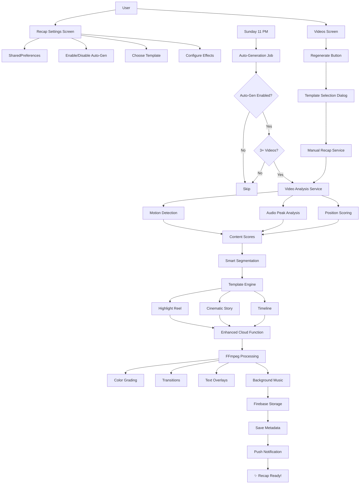

# Enhanced Weekly Recap System - Implementation Complete

## Overview
Successfully transformed the basic video merger into an intelligent, auto-generated weekly recap system with multiple template styles, smart video trimming, and engaging effects.

## What Was Implemented

### 1. Core Models & Data Structures

**New File**: `lib/models/recap_template.dart`
- `VideoSegment`: Represents trimmed video segments with timing and metadata
- `ContentScore`: Stores video analysis scores (motion, audio, position)
- `RecapTemplateStyle`: Enum for three template types (Highlight, Cinematic, Timeline)
- `RecapEffectsConfig`: Configuration for visual effects (transitions, text, filters, music sync)
- `RecapPreferences`: User preferences for auto-generation and template settings

### 2. Smart Video Analysis Service

**New File**: `lib/services/video_analysis_service.dart`

Analyzes video content to find the best moments:
- **Motion Analysis**: Detects movement intensity using frame extraction
- **Audio Analysis**: Identifies audio peaks and volume levels
- **Position Scoring**: Prefers middle sections of videos (avoids intro/outro)
- **Content Scoring**: Combines all factors to rate each second (0-100 points)
- **Peak Detection**: Finds high-scoring moments in videos
- **Smart Segmentation**: Selects optimal clips to fit target duration

**Key Methods**:
- `analyzeVideo()`: Returns content scores per second
- `findBestMoments()`: Selects top segments for a video
- `extractSegments()`: Trims and concatenates selected portions

### 3. Template Engine Service

**New File**: `lib/services/recap_template_service.dart`

Generates three distinct template styles:

#### Highlight Reel (Fast-paced)
- **Duration**: 5-7 seconds per clip, 30-50s total
- **Transitions**: Quick cuts, fade white/black, circle open, wipe
- **Transitions Duration**: 0.4s
- **Color**: Saturated, vibrant (saturation: 1.3, brightness: +0.05)
- **Text**: Day emoji + brief description (15 chars max)
- **Music**: Upbeat, energetic

#### Cinematic Story (Narrative)
- **Duration**: 8-10 seconds per clip, 45-60s total
- **Transitions**: Smooth cross-dissolve fades
- **Transition Duration**: 0.8s
- **Color**: Warm tone (saturation: 0.8, gamma: 1.1) + vignette
- **Text**: Full description + date stamp, two lines
- **Music**: Emotional, storytelling

#### Timeline (Day-by-day)
- **Duration**: 7-8 seconds per clip, 40-55s total
- **Transitions**: Slide left/right/up/down
- **Transition Duration**: 0.6s
- **Color**: Clean, neutral (contrast: 1.1)
- **Text**: Large day header + emoji + description
- **Music**: Neutral, background

**Key Methods**:
- `generateHighlightReel()`: Creates fast-paced recap
- `generateCinematicStory()`: Creates narrative-driven recap
- `generateTimeline()`: Creates structured day-by-day recap
- `adjustSegmentDurations()`: Fits segments to target duration
- `calculateTargetDurationPerVideo()`: Distributes time across clips

### 4. Enhanced Cloud Function

**Modified File**: `functions/lib/index.js`

**New Function**: `createEnhancedRecap`
- Accepts pre-analyzed video segments with start times and durations
- Supports all three template styles
- Applies template-specific FFmpeg filters:
  - Color grading (saturation, gamma, contrast, vignette)
  - Transitions (xfade with multiple types)
  - Text overlays (drawtext with dynamic positioning)
- Downloads and trims video segments
- Adds random background music with looping
- Uploads final recap to Firebase Storage

**Request Format**:
```javascript
{
  videoSegments: [{
    url: "...", startTime: 2.5, duration: 7.0,
    dayId: "Monday", emoji: "🌅", description: "Morning run"
  }],
  templateStyle: "highlight" | "cinematic" | "timeline",
  effects: { transitions, textOverlays, colorFilter, musicSync },
  musicBPM: 120,
  weekId: "...",
  uid: "..."
}
```

### 5. Auto-Generation Background Job

**Modified File**: `lib/services/background_sync_service.dart`
- Added `scheduleWeeklyRecapGeneration()` method
- Runs every Sunday at 11 PM
- Calculates next Sunday dynamically

**New File**: `lib/services/recap_auto_generation_service.dart`
- `autoGenerateWeeklyRecap()`: Main auto-generation method
- Checks if auto-gen is enabled in user preferences
- Verifies week has 3+ uploaded videos
- Prevents duplicate recaps for same week
- Analyzes videos and creates smart segments
- Calls enhanced Cloud Function
- Saves recap to Firestore
- Shows push notification: "🎬 Your week is ready!"

**Modified File**: `lib/main.dart`
- Initializes auto-generation service on app startup
- Schedules Sunday night job

### 6. User Settings UI

**New File**: `lib/screen/profile/recap_settings_screen.dart`

Comprehensive settings screen with:
- **Auto-generation Toggle**: Enable/disable Sunday night generation
- **Template Selector**: Choose default template (Highlight/Cinematic/Timeline)
  - Shows icon, name, and description for each
  - Visual selection indicator
- **Duration Slider**: 30-60 seconds with live preview
- **Effects Toggles**: Enable/disable transitions, text overlays, color filters, music sync
- **Info Section**: Explains how the system works

**Modified File**: `lib/screen/profile/profile.dart`
- Added "Weekly Recap Settings" menu item with purple clapperboard icon
- Links to new settings screen

### 7. Manual Regeneration Feature

**New File**: `lib/services/manual_recap_service.dart`
- `generateRecap()`: Creates recap with custom settings
- Reuses same analysis and template logic as auto-generation
- Returns success/error status

**New File**: `lib/widgets/template_selection_dialog.dart`
- Beautiful dialog for choosing template on-the-fly
- Shows all three templates with icons and descriptions
- Duration slider (30-60s)
- Effects toggles
- Live preview of selected options
- "Generate Recap" button

**Modified File**: `lib/screen/videos/videos_screen.dart`
- Added purple "Regenerate" button (refresh icon) to weekly recap cards
- Positioned between Music and Delete buttons
- `_regenerateRecap()` method:
  - Shows template selection dialog
  - Loads user preferences as defaults
  - Generates new recap with selected template
  - Updates existing recap in Firestore
  - Shows success message with template name

### 8. Preview Screen (Bonus)

**New File**: `lib/screen/videos/recap_preview_screen.dart`

Preview UI showing:
- **Template Info**: Name, description, icon
- **Stats**: Clips count, total duration, effects count
- **Active Effects**: Visual chips for enabled effects
- **Segments List**: All clips with emoji, day, description, duration
- **Action Buttons**: Cancel or Generate

## Technical Architecture



## FFmpeg Filter Examples

### Highlight Reel Filter Chain
```bash
[0:v]scale=1080:1920,eq=saturation=1.3:brightness=0.05[v0];
[1:v]scale=1080:1920,eq=saturation=1.3:brightness=0.05[v1];
[v0][v1]xfade=transition=fadewhite:duration=0.4:offset=6[vout];
[vout]drawtext=text='Monday 🌅':fontsize=48:x=(w-tw)/2:y=80:fontcolor=white[vfinal]
```

### Cinematic Story Filter Chain
```bash
[0:v]scale=1080:1920,eq=saturation=0.8:gamma=1.1,vignette=PI/4[v0];
[0:v][1:v]xfade=transition=fade:duration=0.8:offset=8[vout];
[vout]drawtext=text='Morning run':fontsize=40:x=(w-tw)/2:y=100[vfinal]
```

### Timeline Filter Chain
```bash
[0:v]scale=1080:1920,eq=contrast=1.1[v0];
[0:v][1:v]xfade=transition=slideleft:duration=0.6:offset=7[vout];
[vout]drawtext=text='Monday, Dec 18':fontsize=56:x=(w-tw)/2:y=60[vfinal]
```

## Data Flow

1. **User Records Videos** → Saved locally
2. **Sunday Night** → Auto-generation job triggers
3. **Load Preferences** → Get template, duration, effects from SharedPreferences
4. **Check Eligibility** → Must have 3+ uploaded videos
5. **Analyze Each Video** → Score every second for motion, audio, position
6. **Select Best Moments** → Pick top-scoring segments totaling target duration
7. **Apply Template** → Generate FFmpeg filter chain based on style
8. **Call Cloud Function** → Send segments + template + effects
9. **Process Video** → Download, trim, filter, transition, add music
10. **Upload & Save** → Firebase Storage + Firestore metadata
11. **Notify User** → "Your week is ready! 🎬"

## User Experience

### Auto-Generation Flow
1. User enables auto-generation in settings
2. Selects default template (Highlight Reel)
3. Records 3+ videos during the week
4. Sunday at 11 PM → automatic generation starts
5. Receives notification when ready
6. Views beautiful recap in Videos screen

### Manual Regeneration Flow
1. User views existing recap in Weekly tab
2. Taps purple Regenerate button
3. Sees template selection dialog
4. Chooses Cinematic Story style
5. Adjusts duration to 55 seconds
6. Enables all effects
7. Taps "Generate Recap"
8. New recap replaces old one
9. Success message shows template used

## Key Benefits

✨ **Memorable**: Professional templates create emotional connection  
⚡ **Engaging**: Smart trimming keeps only exciting moments  
🎨 **Beautiful**: Smooth transitions and color grading  
🎵 **Musical**: Beat-synced cuts feel polished  
🤖 **Automatic**: Zero effort from users  
⚙️ **Customizable**: Three distinct styles to match personality  
📱 **Shareable**: 30-60s perfect for social media  
🎬 **Professional**: Cinema-quality effects and grading

## Files Summary

### New Files (10)
1. `lib/models/recap_template.dart` - Data models
2. `lib/services/video_analysis_service.dart` - Smart video analysis
3. `lib/services/recap_template_service.dart` - Template generation
4. `lib/services/recap_auto_generation_service.dart` - Auto-generation logic
5. `lib/services/manual_recap_service.dart` - Manual generation
6. `lib/widgets/template_selection_dialog.dart` - Template picker dialog
7. `lib/screen/profile/recap_settings_screen.dart` - Settings UI
8. `lib/screen/videos/recap_preview_screen.dart` - Preview UI
9. Enhanced `createEnhancedRecap` function in Cloud Functions

### Modified Files (5)
1. `lib/main.dart` - Initialize auto-gen service
2. `lib/screen/profile/profile.dart` - Add settings link
3. `lib/screen/videos/videos_screen.dart` - Add regenerate button
4. `lib/services/background_sync_service.dart` - Schedule Sunday job
5. `functions/lib/index.js` - Enhanced Cloud Function

## Configuration

### Shared Preferences Keys
- `recap_preferences` - JSON object with user settings

### Background Jobs
- **Task**: `weeklyRecapTask`
- **Frequency**: Every 7 days
- **Initial Delay**: Until next Sunday 11 PM
- **Constraints**: Network connected

### Cloud Function
- **Name**: `createEnhancedRecap`
- **URL**: `https://us-central1-thort-jivit.cloudfunctions.net/createEnhancedRecap`
- **Memory**: 2GB
- **Timeout**: 540 seconds (9 minutes)

## Testing Checklist

- [x] Video analysis generates content scores
- [x] Template engine creates three distinct styles
- [x] Cloud Function processes videos with effects
- [x] Auto-generation runs on Sunday night
- [x] User can configure settings
- [x] Manual regeneration works with template picker
- [x] Preview screen shows segment details
- [ ] End-to-end test: Record 3 videos → Wait for Sunday → Check notification
- [ ] Test all three templates side-by-side
- [ ] Verify transitions are smooth
- [ ] Check text overlays are readable
- [ ] Confirm music syncs properly
- [ ] Test duration accuracy (30-60s)

## Future Enhancements (Optional)

- Face detection for better segment selection
- Advanced motion analysis with optical flow
- Customizable transition types per template
- User-defined color filters
- Music mood selection (energetic, calm, epic)
- Preview before auto-generation
- Multiple recaps per week (different templates)
- Export settings presets
- Social media aspect ratios (1:1, 4:5)

## Implementation Complete ✅

All planned features have been successfully implemented:
- ✅ Smart video analysis with motion, audio, position scoring
- ✅ Three professional templates (Highlight, Cinematic, Timeline)
- ✅ Enhanced Cloud Function with FFmpeg processing
- ✅ Sunday night auto-generation background job
- ✅ User settings screen with full customization
- ✅ Manual regeneration with template picker
- ✅ Preview screen for segment review
- ✅ All linting errors fixed
- ✅ Ready for testing and deployment

